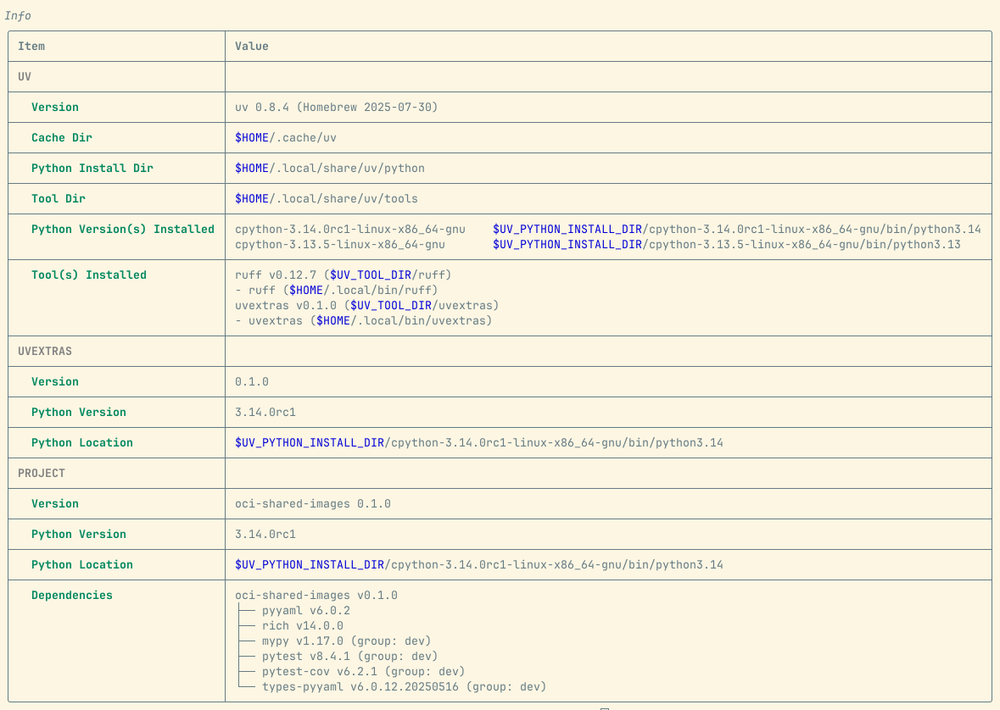
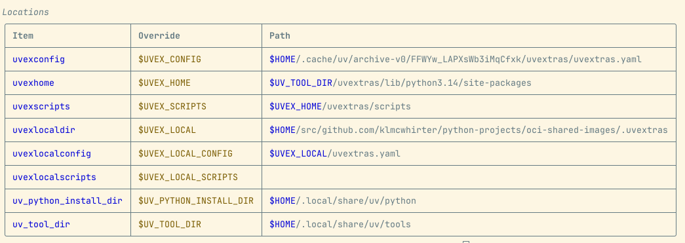
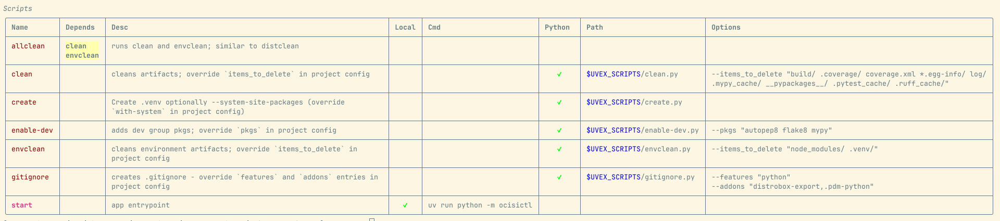

# uvextras

Extra _custom_ features for `uv` as a tool.

Inspired by the need for `pdm` _scripts_ feature set and an `uv info` command.

`uvextras` is written in Python.

To install:

```
uv tool install https://github.com/klmcwhirter/uvextras.git
```

_It is not published to pypi.org_


* [Features](#features)
* [CLI](#cli)
* [Built-in Scripts](#built-in-scripts)
* [Scripts Features](#scripts-features)
* [Info Output](#info-output)

## Features

* _global_ scripts that are accessible from anywhere - e.g., `uvextras run clean`
* _global_ (e.g., script) config can be overridden by local (project) `.uvextras/uvextras.yaml` file
* _local_ scripts merged into list of available scripts by placing in `.uvextras/scripts/` dir
* `info` command that displays `uvextras` metadata and `uv` metadata (command missing in `uv`)


## CLI

```
usage: uvextras [-h] [-f FILE] (info | run) ...

options:
  -h, --help       show this help message and exit
  -f, --file FILE  path to the config file (default: $HOME/.cache/uv/archive-v0/FFWYw_LAPXsWb3iMqCfxk/uvextras/uvextras.yaml)

verbs:
  (info | run)
    info           show info about `uvextras` sub-system and `uv`
    run            run script
```

### info

```
usage: uvextras info [-h] [--all] [-d] [-i] [-l] [-s] [-v]

show info about `uvextras` sub-system and `uv`

options:
  -h, --help       show this help message and exit
  --all            show local and global scripts (default: False)
  -d, --details    show details (default: False)
  -i, --info       hide info table (default: False)
  -l, --locations  hide locations (default: False)
  -s, --scripts    hide scripts (default: False)
  -v, --verbose    enable verbose output (default: False)
```

### run

```
usage: uvextras run [-h] [-v] script [args ...]

run script

positional arguments:
  script         name of script to execute
  args

options:
  -h, --help     show this help message and exit
  -v, --verbose  enable verbose output (default: False)
```
> Note that because `uvextras` uses the `argparse` stdlib module - in order to pass args / options to the named script you will need to use `--` like this:

```
$ uvextras run clean -- --help

usage: clean.py [-h] -i items

options:
  -h, --help            show this help message and exit
  -i, --items_to_delete items
```

> Otherwise, `argparse` intreprets your intention as passing the option to `uvextras run`:

```
$ uvextras run clean --help

usage: uvextras run [-h] [-v] script [args ...]

run script

positional arguments:
  script         name of script to execute
  args

options:
  -h, --help     show this help message and exit
  -v, --verbose  enable verbose output (default: False)
```


## Built-in Scripts

These are defined in [`uvextras.yaml`](./uvextras/uvextras.yaml).

| Script | Comment |
| --- | --- |
| `allclean` | Performs `clean` and `envclean` - like `distclean` but avoid that commonly used name |
| *  `clean` | Clean build artifacts - can override configured `items_to_delete` list (`__pycache__`, `*.o`, etc.) |
| *  `envclean` | Clean environment - can override configured `items_to_delete` list (e.g., `node_modules/`, `.venv/`, etc.) |
| `create` | re-create venv optionally using `--system-site-packages`  - see `uvextras.yaml` |
| `enable-dev` | adds dev group pkgs; override `pkgs` in project config |
| `gitignore` | Generates local `.gitignore` file using `git ignore` alias; override `features` locally (e.g. python,react ) |

## Scripts Features

### How Scripts are Resolved

The scripts may be specified in 3 different ways.

#### Just drop a .py file
Placing a `.py` file in your `.uvextras/scripts` dir makes it available to `uvextras run`. Any script placed in the `uvexlocalscripts` dir will be merged into the list of available scripts using the filename. They will be displayed as _Local_ by `uvextras info`.

These can be just normal python scripts, but are executed via `uv run`. This means that all the features described at [Running scripts](https://docs.astral.sh/uv/guides/scripts/) are available.

Any metadata will be interpretted by `uv run`, but will not display via `uvextras info --details`.

#### Declare the script - location is automatically detected

Declare the script in `.uvextras/uvextras.yaml` with `use-python: true` (the default). The reason you might want to do that is to provide a description and/or set default `options` that should be passed in automatically.

All the data provided in the declaration will display in the output of `uvextras info --details`.

#### Declare script without .py file

In this case, the `use-python: false` setting must be used and a shell `cmd:` must be provided.

Any `options` specified will be interpretted as long options.

Example:

```yaml
# .uvextras/uvextras.yaml

scripts:
  - name: my_script
    desc: Does something really important
    cmd: git log origin
    use-python: false
    options:
      oneline:
      decorate=short:
      color:
      graph:
      abbrev-commit:
```
This will execute the following command line: `git log origin  --oneline --decorate=short --color --graph --abbrev-commit`

### Script with no command

Scripts may declared to do nothing but provide a description and declare dependencies.

_See the allclean script declaration in [./uvextras/uvextras.yaml](./uvextras/uvextras.yaml) for an example._

### Dependencies

Scripts entries may specify the `depends-on` attribute. This is an array of scripts that should run before the requested script is executed.

### Override Options for Built-in scripts

Options may be overriden locally by providing an entry of the same name and with the `is-local: false` attribute set.

The options will be merged into place and be displayed by `uvextras info --details`.

_See the clean and enable-dev script declarations in [./.uvextras/uvextras.yaml](./.uvextras/uvextras.yaml) for examples._

## Info Output

By default, the info verb output displays 3 tables without `--details` - `Info`, `Locations` and `Scripts`.

Here is the output from executing `uvextras info -d --all` in my [oci-shared-images](https://github.com/klmcwhirter/oci-shared-images) project dir.







